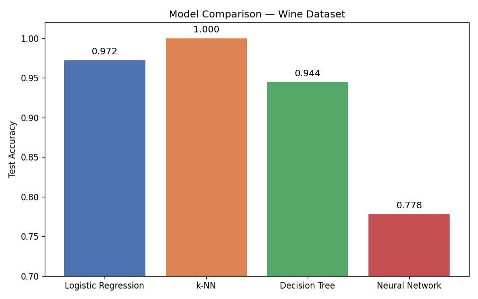
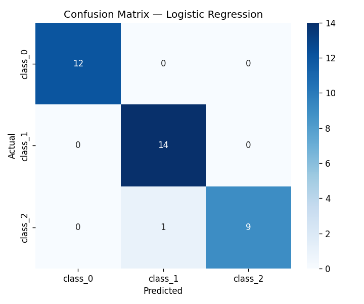
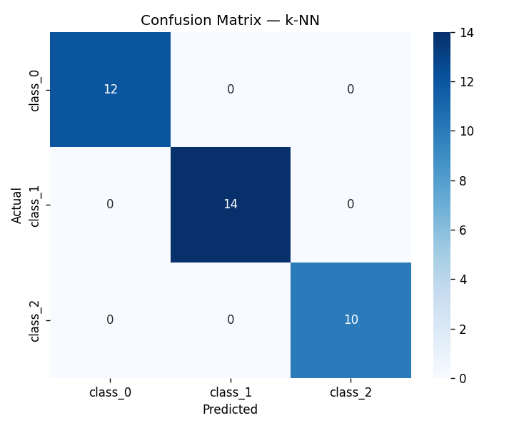
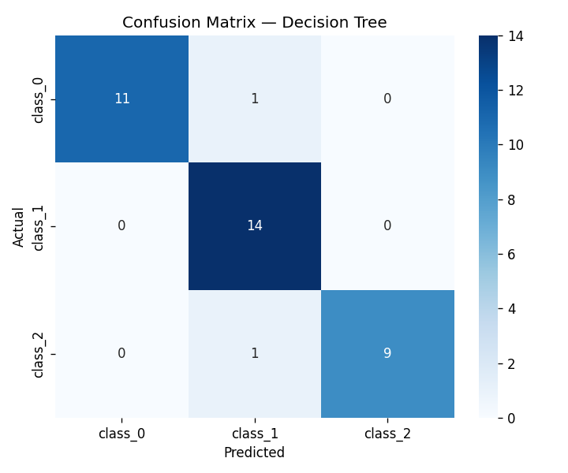
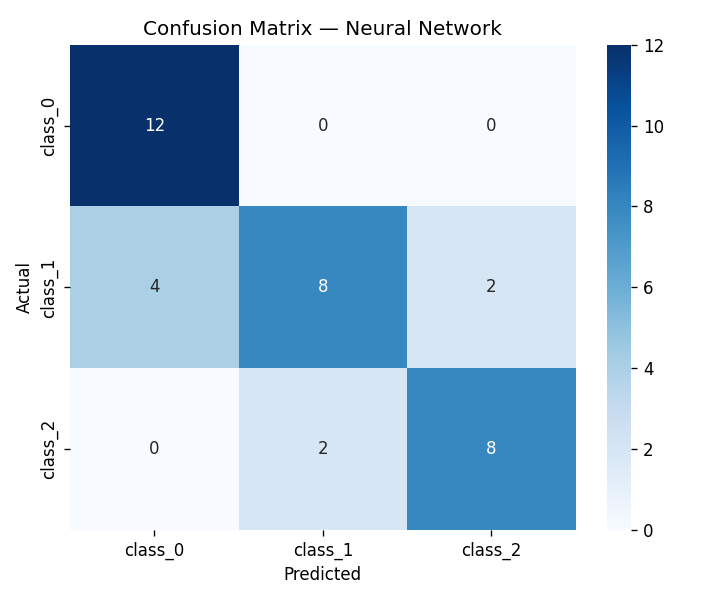

# Model Comparison on Tabular Data

Comparing four classification algorithms on the [Wine dataset](https://scikit-learn.org/stable/datasets/toy_dataset.html#wine-recognition-dataset) to understand how model choice affects performance on structured data.

## Dataset

| Property | Value |
|---|---|
| Source | `sklearn.datasets.load_wine` |
| Samples | 178 |
| Features | 13 (alcohol, malic acid, ash, …) |
| Classes | 3 (class_0, class_1, class_2) |
| Train / Test split | 80% / 20% (stratified) |

All features were standardized with `StandardScaler` before training.

---

## Models

| Model | Key hyperparameters |
|---|---|
| Logistic Regression | `C=1.0`, `max_iter=500` |
| k-NN | `k=7` (grid search over k=1..20), `metric=euclidean` |
| Decision Tree | `max_depth=5`, `criterion=gini` |
| Neural Network (MLP) | `hidden=(64,32)`, `relu`, `early_stopping=True` |

---

## Results

### Test Accuracy (hold-out)

| Model | Accuracy |
|---|---|
| Logistic Regression | 0.9722 |
| **k-NN** | **1.0000** |
| Decision Tree | 0.9444 |
| Neural Network | 0.7778 |

### 5-Fold Cross-Validation

| Model | Mean Acc | Std |
|---|---|---|
| **Logistic Regression** | **0.9833** | ±0.0136 |
| k-NN | 0.9719 | ±0.0252 |
| Decision Tree | 0.8989 | ±0.0290 |
| Neural Network | 0.8935 | ±0.0577 |

### Accuracy Comparison



### Confusion Matrices

| Logistic Regression | k-NN |
|---|---|
|  |  |

| Decision Tree | Neural Network |
|---|---|
|  |  |

---

## Discussion

**Why does k-NN achieve perfect accuracy on the hold-out set?**  
With `k=7` (tuned via grid search over k=1..20) and only 36 test samples, k-NN captures the local structure of the feature space very effectively. The Wine dataset is compact and well-separated in the standardized 13-dimensional space, so majority voting among the 7 nearest neighbors classifies every test point correctly.

**Why does Logistic Regression top the cross-validation ranking?**  
Across 5 folds the linear decision boundary proves most stable. Wine's chemical features are nearly linearly separable after scaling, and LR's L2 regularization prevents overfitting on each fold. k-NN's CV score drops slightly (0.9719) because its performance is more sensitive to which specific samples end up in each fold.

**Why does the Neural Network underperform on this dataset?**  
With only 178 samples the MLP struggles to generalise — early stopping kicks in very early due to the tiny 10% validation split (~14 samples), leaving the network undertrained. This is a classic case of model complexity exceeding what the data size can support.

**Why does Decision Tree lag behind?**  
Even with `max_depth=5`, the greedy axis-aligned splits produce a less smooth decision boundary than LR. It also shows the highest CV standard deviation (±0.029), indicating sensitivity to the training subset.

**Key takeaway:** For small, well-structured tabular datasets a regularized linear model (LR) offers the best bias-variance tradeoff. k-NN can match or beat it on a single split but shows higher variance in CV. Neural networks need substantially more data to justify their complexity.

---

## Project Structure

```
model-comparison/
├── data/
│   └── load_data.py          # dataset loading & preprocessing
├── models/
│   ├── logistic_regression.py
│   ├── knn.py
│   ├── decision_tree.py
│   └── neural_network.py
├── experiments/
│   ├── run_comparison.py     # single train/test run + plots
│   └── cross_validate.py     # k-fold CV across all models
├── results/                  # generated plots & summary.json
└── README.md
```

## How to Run

```bash
pip install -r requirements.txt

# Single train/test split + confusion matrices
python experiments/run_comparison.py

# 5-fold cross-validation
python experiments/cross_validate.py
```
